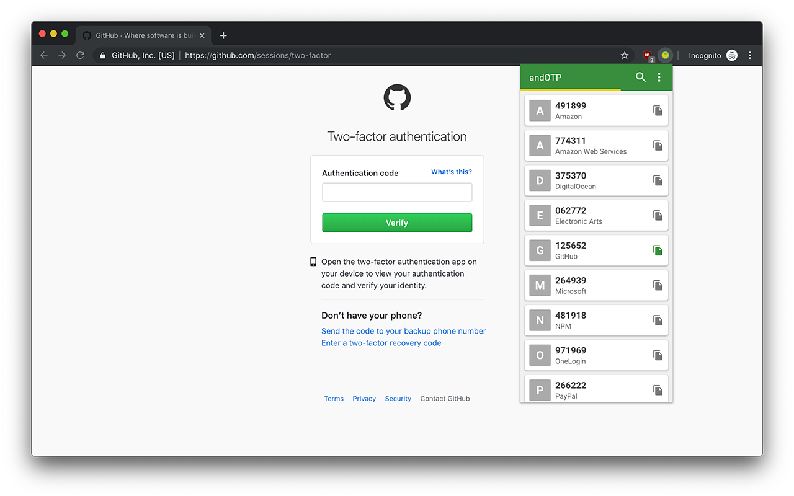

# andOTP Extension

Restore your backups and access your two-factor authentication tokens from your browser. No phone is required after you import the backup. Limited to plain-text JSON backups right now.

## Download andOTP

## Setup

To use this extension, you must restore a backup using the app.

### andOTP Backup

1. Open **andOTP** on your phone.
1. Open the **Options Menu**.
1. Tap **Backup**.
1. Tap **Backup (plain-text)**.
1. Accept the security warning.
1. Pick a place to save the backup and transfer it to your computer.

### andOTP Extension Restore

1. Install this extension from the [Chrome Web Store](https://chrome.google.com/webstore/detail/andotp/apbpiclbhifcmlbhbhillogjkphjdamd).
1. Right click the **andOTP Extension** icon in the extension area and select **Options**.
1. Click **Restore** and select your backup.
1. You're done!

## Usage

Left clicking the **andOTP Extension** icon will show a dropdown of all your accounts.

Features right now include:

- Copy to clipboard
- Text search filter
- Auto refresh tokens
- No phone required after restoring a backup

Planned features:

- Add encrypted backup support
- Add dark theme
- Add thumbnail support
- Add auto sync with phone feature
